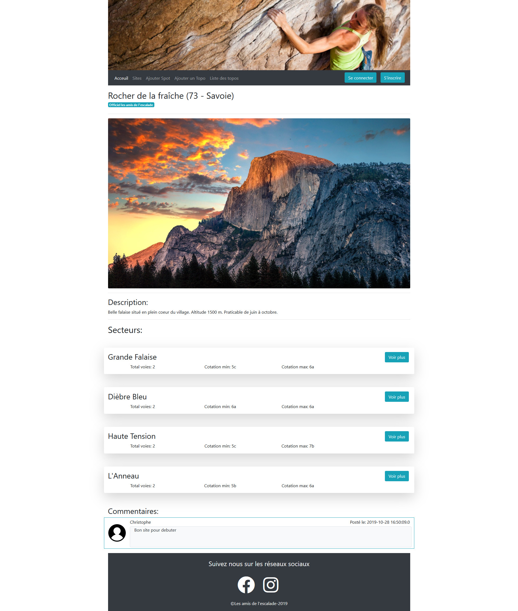

# Les amis de l'escalade

Les amis de l'escalade est site communautaire autour du thème de l'escalade, cette application web JEE a été réalisée dans le cadre du parcours Développeur d'application Java de la plateforme d'enseignement OpenClassrooms. 

Les compétences évaluées sont les suivantes:
* Gerer ses données avec une base de données
* Gérer les dépendances et packager une application avec Apache Maven
* Développer une application proposant les fonctionnalités attendues par le client
* Stocker et récupérer les informations dans la base de données en langage SQL

## Guide de démarrage

### Prérequis
* _PostgreSQL_, système de gestion de base de données, disponible [ici](https://www.postgresql.org/download/).  
* _pgAdmin_, outil d'administration de PostgreSQL, disponible [ici](https://www.pgadmin.org/download/).
* _Tomcat_, conteneur web, disponible [ici](https://tomcat.apache.org/download-90.cgi)
* Le fichier _lesamisdelescalade-webapp-1.0-SNAPSHOT.war_ disponible à la racine du répertoire Github.

### Installation

#### I. Installation de l'application
 1. Ouvrir le répertoire d'installation de _Tomcat_.
 2. Déposer le fichier **lesamisdelescalade-1.0.war** dans le répertoire /webapps.
 3. Renommer le fichier _"lesamisdelescalade"_.
 
#### II. Création de la base de données 
Créer une base de données nommée "lesamisdelescalade" à l'aide pgAdmin.

#### III. Import des données

 * À l'aide de pgAdmin, éxécuter dans cet ordre les script SQL:
  1. _create_table.sql_
  2. _data_demo.sql_

Ces deux fichiers se trouvent dans le répertoire /database

#### IV. Paramètrage de la connexion à la base de données

 1. Ouvrir le répertoire d'installation de _Tomcat_.
 2. Dans le répertoire _/conf_, ouvrir le fichier **context.xml**.
 3. Inserer entre les balises `<Context></Context>` le code ci-dessous:
 ```
<Resource name="jdbc/lesAmisDeLEscalade"
    auth="Container"
    type="javax.sql.DataSource"
    username=""
    password=""
    driverClassName="org.postgresql.Driver"
    url="jdbc:postgresql://localhost:5432/lesamisdelescalade"
    maxTotal="8"
    maxIdle="4"/>
```
 4. Complétez les champs _username_ et _password_ avec les données de connexion de l'utilisateur qui aura accès à la base de données.

 ### Démarrage

  1. Lancer _Tomcat_.
  2. À partir d'un naviguateur web, rendez vous à l'adresse : _http://localhost:8080/lesamisdelescalade/_ 

## Technologies utilisées

* JEE 
* Spring
    * Spring JDBC
    * Spring MVC
    * Spring Transaction Management
* JSP
* Bootstrap
* Maven

## Aperçu du site



## Auteur

 * **Charles Cathala** - [ccathala](https://gist.github.com/ccathala)